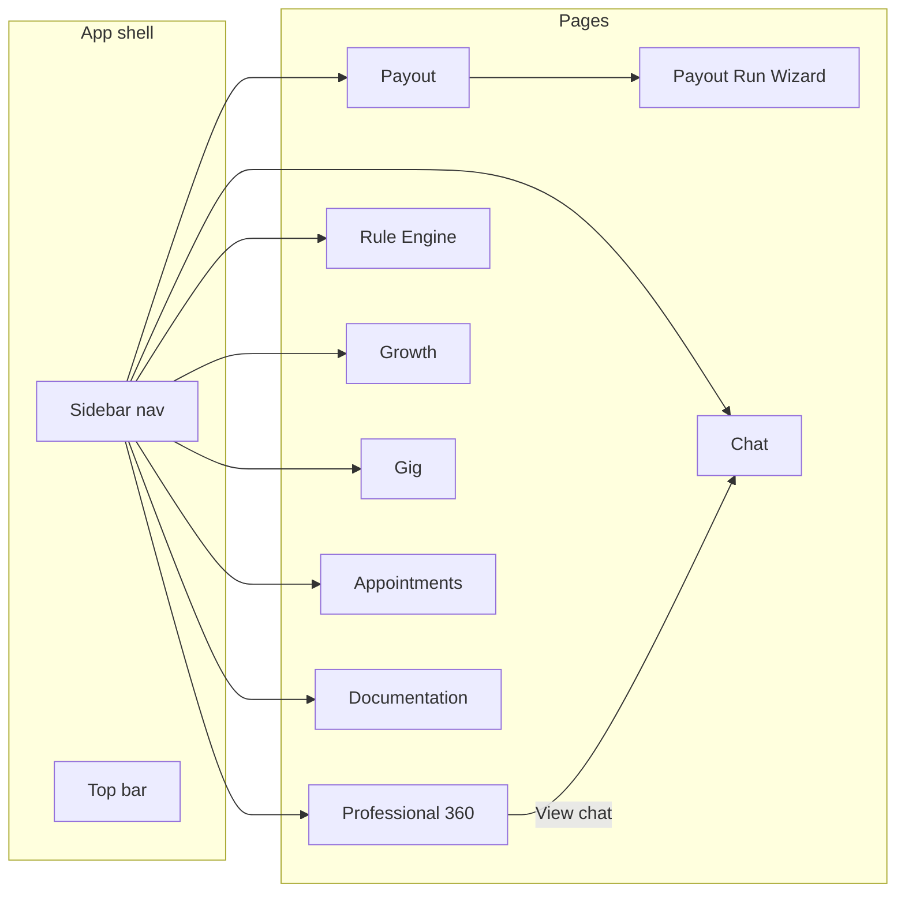
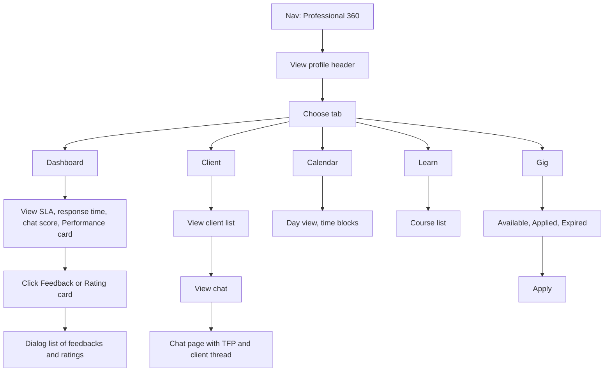
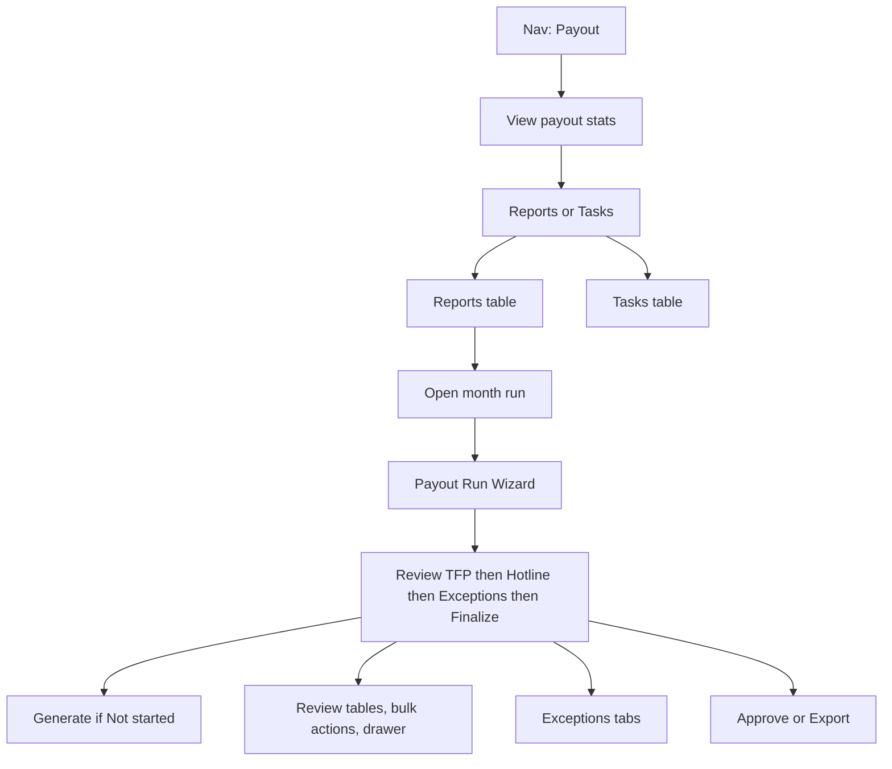
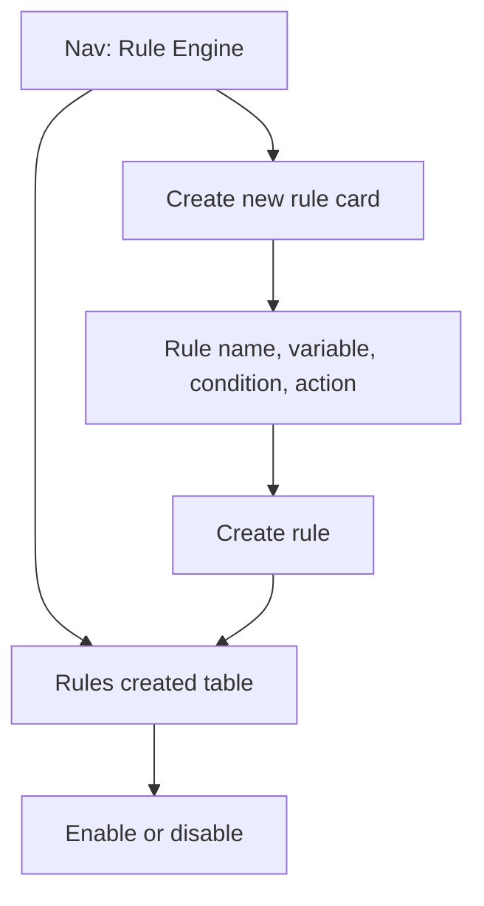
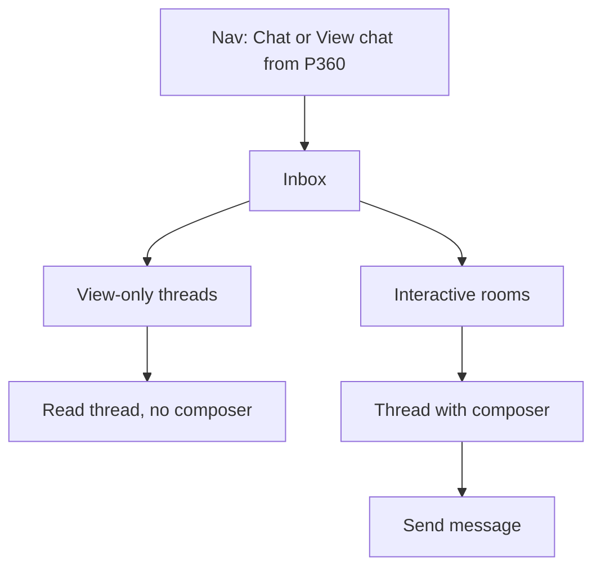

# Pro360 Clinical Ops Pitch – Sarah Lee Journey

## Approach

- **Persona**: Sarah Lee, Clinical Ops. All pages are from her POV; nav and copy reflect Clinical team context.
- **Scope**: Frontend only (no API/backend). Mock data in `lib/mock/` (e.g. professionals, payout, payoutRun, rules, chat, lms, gig, appointments).
- **Auth**: No login/signup. Implied logged-in state: global app shell with avatar, "Sarah Lee", "Clinical Ops", and logout icon.
- **Design**: Modern SaaS — clean typography, **drop shadows** for elevation (no gray-outline cards), clear hierarchy, optional dark mode. One accent (blue primary), neutrals, semantic colors for status. Avoid generic "AI slop"; use a consistent, restrained palette.

---

## Stacks used

- **Next.js 14** (App Router) — file-based routing, `app/` layout and pages.
- **React 18** — UI.
- **Tailwind CSS** — layout and styling; design tokens in `app/globals.css` (e.g. `--primary`, `--card`, `--muted`, `--border`).
- **UI primitives**: **Radix UI** — Dialog, DropdownMenu, Select, Tabs, Slot. Custom wrappers in `components/ui/` (button, card, input, badge, table, dialog, dropdown-menu, select, tabs).
- **Icons**: **Solar icons via @iconify/react** (shared app icons + warning/danger in SpiderChart).
- **Utilities**: **clsx**, **tailwind-merge**, **class-variance-authority**, **tailwindcss-animate**.
- **Charts**: Custom **SpiderChart** (radar) for Professional 360 Performance strengths; no Recharts/Tremor.
- **Docs**: **react-markdown**, **remark-gfm** for the in-app Documentation page (`/docs`).

---

## UI layout and patterns

- **Shell**: **Sidebar** (left, collapsible on desktop; hamburger drawer on mobile) + **Top bar** (breadcrumbs, theme toggle, user block, logout). Main content in a scrollable area with `max-w-7xl` and consistent padding.
- **Breadcrumbs**: Rendered in the **top bar** via `BreadcrumbContext` and `PathnameBreadcrumbSync`; path-based defaults (e.g. `/payout` → "Payout", `/payout/run/[runId]` → "Payout > Generate payout #P022026").
- **Cards and surfaces**: **Drop shadow** instead of outline — shared utilities:
  - **`.shadow-card`**: Default card elevation (light and dark variants in `globals.css`).
  - **`.shadow-panel`**: Stronger shadow for floating panels (dialogs, dropdowns, select content).
  - Card component and dialog use these; no `border border-border` for card chrome.
- **Tables**: Used for dense, scannable data (Reports, Tasks, Rules, LMS, Gig, Appointments, Case Notes, etc.). **Table title sits outside the card** (e.g. "Case Notes Submission Log", "Rules created") as an `<h2>` above the card; card contains only the table and optional pagination.
- **Tabs**: **Line-style tabs** (underline on active) via `components/Tabs.tsx` — e.g. Professional 360 (Dashboard, Client, Calendar, Learn, Gig), Payout main (Reports, Tasks), Exceptions step (Flagged deltas, Too small, Unclaimed, FX, Failed payments). Same pattern as "tab with line" used in Professional 360.
- **Bento-style**: Dashboard and metric-heavy views use a **grid** of cards (e.g. Professional 360 Dashboard, Payout run KPIs). Mix of stat cards and tables as appropriate.
- **Pagination**: Shared **TablePagination** (page size selector, "Showing X to Y of Z", prev/next) for list tables.
- **Glass / depth**: Used sparingly; e.g. Performance strengths card (electric blue gradient + glass chart area), modals/overlays. Not applied globally.

---

## Global shell and navigation

- **Sidebar**: "Pro360" logo/link; nav items with icons: **Professionals** (`/professionals`), **Payout** (`/payout`), **Rule Engine** (`/rules`), **Chat** (`/chat`), **Growth** (`/lms`), **Gig** (`/gig`), **Appointments** (`/appointments`). Below nav: **Documentation** (`/docs`), Help and Support, Settings. Active state: highlight + left accent bar. Collapsible to icon-only on desktop; on mobile, overlay drawer with close on navigate.
- **Top bar**: Breadcrumbs (left), theme toggle (Light/Dark/System), user avatar + "Sarah Lee" + "Clinical Ops", logout icon. Breadcrumbs reflect current route (e.g. `/docs` → "Documentation", payout run id in breadcrumb).
- **Root**: `/` redirects to `/professionals/PRO-001/performance`.

---

## Page-by-page specification

### 1) Professional Performance + Account

- **Routes**:
  - `/professionals/[id]/performance` (default Pro360 view)
  - `/professionals/[id]/account`
  - `/professionals/[id]/account/edit`
- **Top**: Profile header — photo placeholder, name, license/expiry, role/status.
- **Tabs** (line-style): **Dashboard** | **Client** | **Calendar** | **Learn** | **Gig**.
  - **Dashboard**: Performance strengths & AI analysis card (electric blue gradient in light/dark; spider chart with white/transparent "webs", Solar warning icon for axes below threshold; AI recommendation for flagged rows; "Generate improvement summary" CTA). Metric cards: SLA/TFP+, Messages 24h, Avg Response Time, Client Chat Hours, TFP Chat Score, Payout Multiplier, Feedback, Rating, Missed/Late Sessions, Excessive Sessions, Late/Missing Case Notes. **Case Notes Submission Log**: title **outside** card; card contains table (Date, Client, Submitted At, Status) + TablePagination.
  - **Client**: Client list (table or cards); "View chat" → Chat scoped to that TFP↔Client.
  - **Calendar**: Day view with time blocks (F2F, Pod, Townhall); month strip; upcoming events card.
  - **Learn**: Course list (cards) — title, module type, enrollment, progress.
  - **Gig**: Jobs — Available / Applied / Expired; Apply per job.
- **Feedback / Rating**: Click card → dialog with full list (mock).

### 2) Payout

- **Route**: `/payout`.
- **Stats cards**: Total payout this month, Vs last month (no status pill row).
- **Tabs**: **Reports** | **Tasks**.
  - **Reports**: Table — Report (month), Reviewer, Generated, Status, Actions. Filters: search, Reviewer, Status. TablePagination. Row action "Generate" for not-started month; "Export" for generated. No Draft/In review/Completed pill row on same row as filters.
  - **Tasks**: Task table (reviewer, status, task type, date) with pagination.
- **Run wizard**: From report row → `/payout/run/[runId] `(e.g. `2026-02`). Breadcrumb in **top bar**: "Payout > Generate payout #P022026" (format #P + MM + YYYY). No "Step 0 – Generate"; stepper has 4 steps: **Review TFP Sheet** | **Review Hotline Ops Sheet** | **Exceptions & Reconciliation** | **Finalize**. When run status is "Not started", step 1 shows a single "Generate" CTA card; after Generate, run is Draft and step 1 shows full TFP sheet (KPIs, filters, table with pagination). **Back to Payout** not duplicated in content (breadcrumb is primary). **Save as draft** button + autosave (localStorage). **Bulk select**: row checkboxes; bulk bar (Assign reviewer, Mark Ready, Hold, Add note). **Drawer** (TFP or Hotline row): slide-in animation; TFP shows earnings breakdown and **AI recommendation** block for flagged rows (why flagged, what to do next); Hotline shows **validation checklist** (check-in/out, duration) and **shift list** (mock). Step 3 **Exceptions**: tabs (Flagged deltas, Too small, Unclaimed, FX, Failed payments); one list per tab. Step 4 Finalize: readiness checklist, Approve, Export, Audit log placeholder.

### 3) Rule Engine

- **Route**: `/rules`.
- **Top stats**: Three cards — Total Rules (with enabled count), Total Triggers (all time), Active Today (rules triggered).
- **Create new rule**: Card with form — **Rule name**, variable, condition, action; "Create rule" adds to list (mock).
- **Rules created**: **Title "Rules created" outside card**. Card contains table: Rule name, Trigger, Action, Enabled (toggle), Times triggered. Mock rules.

### 4) Chat

- **Route**: `/chat`.
- **Layout**: Email-like — left panels (narrow: All / View-only / Interactive + professionals; wider: thread list), center (thread messages), optional right (metadata, annotations, risk). **Main container**: drop shadow (shadow-card), no gray outline; internal dividers subtle (border-border/50).
- **View-only**: TFP↔Client, Pod↔TFP — read-only; no composer. "View only – No intervention" badge when applicable.
- **Interactive**: Clinical↔All TFPs, Clinical↔Specific TFP — composer at bottom; send as Sarah Lee.
- **Context menu**: "Annotate as dangerous" etc. — floating menu with shadow-panel, no border.
- **Annotations list**: Items use shadow-card.

### 5) Growth (LMS)

- **Route**: `/lms`.
- **Content**: Module cards (name, label, time spent, users taken, pass count). Optional "Add module" / "View analytics". Cards use default shadow; hover can use shadow-panel.

### 6) Gig

- **Route**: `/gig`.
- **Content**: Job list (cards or table); "Create job" CTA. Cards consistent with shadow-card.

### 7) Appointments

- **Route**: `/appointments`.
- **Features**: Type filter (User, Pod, Townhall). Table: date, type, participants, duration, attendance, AI rating, AI review. Icons per type use Solar set (e.g. user/group/megaphone).

### 8) Calendar (standalone)

- **Route**: `/calendar`. Optional standalone day view (same mock data as Professional 360 Calendar tab). Event type styling with shadow-card; selected event detail card.

### 9) Documentation

- **Route**: `/docs`.
- **Content**: Rendered markdown from `docs/PRO360_PITCH_PLAN.md` (this pitch plan). Linked from sidebar as "Documentation". Breadcrumb: "Documentation".

---

## Design direction

- **Reference**: Clean, modern SaaS (Supabase/Vercel style) — light default, calm, professional. Not aligned to FlyonUI or any external dashboard template.
- **Typography**: System font stack (e.g. UI sans); clear hierarchy (headings medium/bold, body regular). Mono for codes/IDs if needed.
- **Color**: Light theme default. Neutral background (e.g. 99% gray); primary blue (e.g. 221 96% 54%). Semantic: draft/in progress/completed, success, warning, destructive used sparingly. Dark mode: full token set in `.dark` (background, card, muted, border, etc.).
- **Surfaces**: Cards and panels use **drop shadow** (shadow-card / shadow-panel), not outline. Borders only where needed for structure (e.g. table row dividers, subtle panel borders border-border/50). Performance card: electric blue gradient (light: radial + linear; dark: layered radial + linear) with "popping off" shadow; chart area glass (backdrop-blur, light fill).
- **Spacing**: Generous padding and gaps; max-width content area (max-w-7xl).
- **Components**: Buttons and inputs minimal; tables with clear headers and hover. Stat cards: one main number, optional trend/subtitle. **Table titles** (e.g. "Case Notes Submission Log", "Rules created") are **outside** the card, above it.
- **Theme**: Theme toggle in top bar (Light / Dark / System); persisted (e.g. localStorage); applied via class on root.

---

## Information architecture

---

## User flows (Sarah Lee – Clinical Ops)

### Professional 360

### Payout

### Rule Engine

### Chat

### LMS, Gig, Appointments

- **LMS**: Nav → Growth → module list (cards); optional Add / Analytics.
- **Gig**: Nav → Gig → job list; Create job.
- **Appointments**: Nav → Appointments → type filter → table (date, type, participants, attendance, AI rating).

---

## File structure (current)

- `app/layout.tsx` — Root layout, AppShell.
- `app/page.tsx` — Redirect to `/professionals/PRO-001/performance`.
- `app/professionals/[id]/performance/page.tsx` — Professional performance (Pro360) with tabs.
- `app/professionals/[id]/account/page.tsx` — Professional account view.
- `app/professionals/[id]/account/edit/page.tsx` — Account edit route.
- `app/payout/page.tsx` — Payout dashboard (Reports, Tasks).
- `app/payout/run/[runId]/page.tsx` — Payout run wizard (4 steps, drawer, bulk, exceptions tabs).
- `app/rules/page.tsx` — Rule Engine (create form + rules table).
- `app/chat/page.tsx` — Chat (inbox, thread, view-only vs interactive).
- `app/lms/page.tsx` — Growth (LMS modules).
- `app/gig/page.tsx` — Gig (jobs).
- `app/appointments/page.tsx` — Appointments table.
- `app/calendar/page.tsx` — Standalone calendar day view (optional).
- `app/docs/page.tsx` — Documentation page; reads and renders `docs/PRO360_PITCH_PLAN.md`.
- `app/globals.css` — Tokens, shadow-card / shadow-panel, sidebar styles.
- `components/AppShell.tsx` — Sidebar + TopBar + main content; ThemeProvider, BreadcrumbProvider, PathnameBreadcrumbSync.
- `components/Sidebar.tsx` — Nav links, collapse, mobile drawer.
- `components/TopBar.tsx` — Breadcrumbs, theme toggle, user, logout.
- `components/BreadcrumbContext.tsx`, `components/Breadcrumbs.tsx`, `components/PathnameBreadcrumbSync.tsx` — Breadcrumb in top bar.
- `components/Tabs.tsx` — Line-style tabs (underline active).
- `components/TablePagination.tsx` — Shared pagination.
- `components/SpiderChart.tsx` — Radar chart (Performance card); Solar warning icon.
- `components/MarkdownContent.tsx` — Renders markdown (react-markdown) for `/docs`.
- `components/ThemeProvider.tsx` — Light/Dark/System.
- `components/ui/*` — Card, Button, Input, Badge, Table, Dialog, Select, Dropdown, Tabs (Radix).
- `lib/mock/*` — professionals, payout, payoutRun, rules, chat, lms, gig, appointments.
- `docs/PRO360_PITCH_PLAN.md` — Pitch plan (source for `/docs`). Optional: `docs/PRO360_FLYONUI_MAP.md`.

---

## Out of scope

- Login / signup; logout is UI only.
- Backend, API, database.
- Real auth, real chat, real payout or rule execution.

This document reflects the current journey, stacks used, UI layout and patterns, page-by-page spec, design direction (no FlyonUI alignment), and updated information architecture and user flows.
