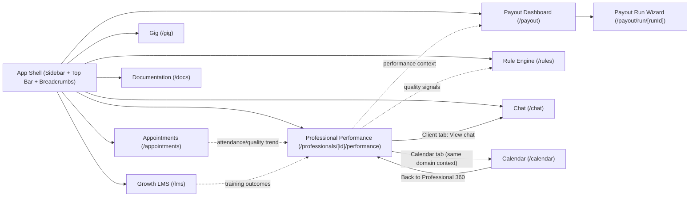

# Pro360 Product Requirements Document (PRD)

## 1) Product Summary
Pro360 is a Clinical Operations command center for managing professional performance, payouts, communication oversight, learning, gigs, and appointments from a single workspace.

Current system state: frontend-only, mock-data driven, no authentication, with a shared app shell and linked operational pages.

## 2) Vision, Problem, and Outcomes
### Vision
Give Clinical Ops one place to monitor quality, act on risk, and complete operational workflows quickly with clear handoffs.

### Core problems this product solves
- Clinical managers currently need multiple tools to assess professional quality and action payout exceptions.
- Operational risk signals (chat, session quality, SLA, case notes) are fragmented and hard to prioritize.
- Workflow continuity is weak when moving from insight to action (example: performance issue -> rule -> payout review -> communication).

### Target outcomes
- Reduce time to identify and resolve payout and quality exceptions.
- Increase confidence in quality oversight (with explainable AI signals and audit-friendly actions).
- Improve operational throughput across high-volume recurring tasks.

## 3) Primary User and Jobs To Be Done
### Primary user
- Sarah Lee (Clinical Ops Manager)

### Core jobs
- Evaluate professional performance and identify interventions.
- Move from alerts/signals to concrete actions (message, annotate, create rule, payout review).
- Execute monthly payout review and reconciliation.
- Track compliance and engagement (appointments, training, gigs).

## 4) Scope
### In scope (current + intended)
- Professional 360 profile and tabbed operational view.
- Payout reporting and 4-step run workflow.
- Rule Engine for threshold/action logic.
- Chat monitoring and intervention modes.
- Growth (LMS), Gig, Appointments modules.
- Standalone Calendar and in-app Documentation.

### Out of scope (current release)
- Backend integrations and live data sync.
- Real auth/roles/permissions.
- External notification delivery (email/Slack/webhooks).
- Financial system disbursement execution.

## 5) Product Modules and Page Architecture
## Module A: App Shell & Navigation
- Global frame: sidebar + top bar + breadcrumbs + theme.
- Purpose: persistent navigation and context continuity.

Pages:
- `/` -> redirects to `/professionals/PRO-001/performance`
- Shared shell around all routes

## Module B: Professional Operations (Professional 360)
- Professional profile header and operational tabs.
- Tabs: Dashboard, Client, Calendar, Learn, Gig.

Pages:
- `/professionals/[id]/performance`
- `/professionals/[id]/account`
- `/professionals/[id]/account/edit`

Key responsibilities:
- Surface performance/quality KPIs.
- Provide drill-downs (feedback, ratings, SLA info).
- Bridge to communication (client row -> view chat).

## Module C: Payout Operations
- Payout dashboard (reports/tasks) and run execution wizard.

Pages:
- `/payout`
- `/payout/run/[runId]`

Key responsibilities:
- Discover monthly reports and status.
- Execute review workflow:
1. Review TFP sheet
2. Review Hotline Ops sheet
3. Exceptions & reconciliation
4. Finalize

## Module D: Rule Engine
- Configure if-this-then-that style operational rules.

Page:
- `/rules`

Key responsibilities:
- Create rules (name, variable, condition, action).
- Review rules list and trigger counts.

## Module E: Communication Oversight
- Threaded chat with view-only and interactive contexts.

Page:
- `/chat`

Key responsibilities:
- Monitor read-only conversations.
- Participate in intervention channels.
- Annotate risky excerpts (context menu).

## Module F: Growth (LMS)
- Module performance and participation tracking.

Page:
- `/lms`

Key responsibilities:
- View module stats and learning coverage.
- Trigger add module / analytics actions.

## Module G: Gig Marketplace Operations
- Track and manage open/approved/completed gigs.

Page:
- `/gig`

Key responsibilities:
- Monitor postings and applications.
- Trigger create/edit job flows.

## Module H: Appointment Quality Operations
- Operational view of scheduled/attended/no-show sessions with AI ratings.

Page:
- `/appointments`

Key responsibilities:
- Filter by appointment type.
- Assess attendance and AI-derived quality signals.

## Module I: Calendar
- Day-view schedule with event detail side panel.

Page:
- `/calendar`

## Module J: Product Documentation
- In-app markdown rendering of product docs.

Page:
- `/docs`

## 6) Page Interconnection Model
### Primary navigation links (sidebar)
- Professional 360 -> Payout -> Rule Engine -> Chat -> Growth -> Gig -> Appointments -> Documentation

### Cross-page deep links
- Professional 360 (Client tab, “View chat”) -> Chat
- Payout (Reports actions: Generate/Continue) -> Payout Run
- Calendar page provides return link -> Professional 360
- Root redirect -> Professional Performance (Pro360)

### Conceptual data dependencies (intended)
- Professional performance signals should influence:
  - Rule Engine rule design
  - Payout exception review prioritization
  - Chat intervention decisions
- Appointments and LMS trends should feed professional quality scoring.

## 7) User Flow Diagram (Modules + Pages)

## 8) Functional Requirements by Module
### Professional 360
- Must show profile identity and license details.
- Must provide tabbed views for dashboard/client/calendar/learn/gig.
- Must allow opening feedback/rating detail dialogs.
- Must support “View chat” deep-link from client records.

### Payout
- Must support report filtering and action states (generate/continue/export).
- Must support 4-step run navigation.
- Must allow bulk actions in review tables.
- Must preserve draft progress locally.

### Rule Engine
- Must support creating a rule from predefined dimensions/actions.
- Must display rule inventory and trigger volume.

### Chat
- Must separate view-only and interactive threads.
- Must disable message composer for view-only threads.
- Must support contextual annotation in monitored threads.

### LMS / Gig / Appointments
- Must provide searchable/filterable operational lists.
- Must show module-level KPIs at top of each page.

## 9) Gaps: Usability and Product Vision
## A) Usability gaps
1. Missing global search and command navigation
- Impact: slower cross-module movement for high-frequency users.

2. Inconsistent action completion paths
- Example: several CTAs are present but effectively placeholder-only (Add Module, Analytics, Create Job), which creates dead ends.

3. Weak continuity between modules after deep links
- Example: jumping from Professional 360 to Chat does not visibly preserve selected client/professional context in a strong, explicit header state.

4. Dense workflows without guided progress affordances
- Payout run has steps but no clear completion checklist per step or quality gates surfaced at top-level.

5. Limited error/empty/success states
- Current UI is optimized for happy-path mock data; operational edge cases are under-specified.

## B) Vision gaps
1. Product promise is “command center,” but modules are mostly parallel, not orchestrated
- Needed: stronger decisioning layer that links quality signals to recommended actions across rule, payout, and communication modules.

2. No explicit north-star metrics in-product
- Needed: persistent operational outcomes (time to resolution, exception aging, quality risk trend) to reinforce value.

3. AI appears as isolated UI features, not workflow infrastructure
- Needed: explainability, confidence, and action traceability standards across all AI-assisted decisions.

4. Single persona assumption
- Needed: role model for Clinical Ops lead vs reviewer vs supervisor to support scale.

## 10) Recommended Next Iteration (High Priority)
1. Add a cross-module “Case Context” rail
- Persistent entity context (Professional, Client, Period) while navigating across Professional 360, Chat, and Payout.

2. Add operational orchestration queue
- Unified queue of “items requiring action” sourced from rules, payout exceptions, no-shows, and high-risk chat annotations.

3. Define completion states and guardrails per workflow
- Especially in Payout Run: explicit readiness checks and blockers before finalize.

4. Formalize module contracts
- Input/output contracts between modules (what data/state is passed when navigating), even before backend integration.

5. Introduce role-aware mode
- Minimal role presets to validate future permission and handoff models.

## 11) Success Metrics (for next phase)
- Median time to resolve payout exception.
- % of high-risk professionals with action taken within SLA.
- Monthly no-show trend and intervention conversion.
- Reviewer throughput per payout cycle.
- Cross-module journey completion rate (Professional 360 -> action in Chat/Rule/Payout).
