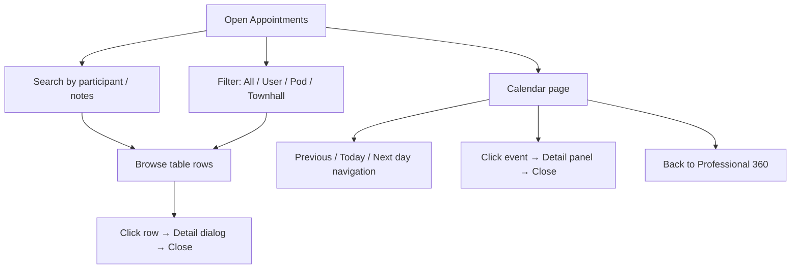

# Appointments

## Module explanation

Appointments is the scheduling and attendance oversight module. It provides filtered views across user sessions, pod sessions, and townhall events, with AI review indicators and detail dialogs. A dedicated calendar page provides day-level schedule navigation.

## User flow

### Journey 1 — Browse and filter appointments

**Scenario 1a: Search appointments**

1. Open **Appointments** from the sidebar.
2. Type in the **search input** to filter by participant name or notes.

**Scenario 1b: Filter by appointment type**

1. Click the **type filter buttons** (All, User, Pod, Townhall) to filter by appointment type. Each button shows a count badge.

### Journey 2 — Inspect appointment details

**Scenario 2a: Open the detail dialog**

1. Click a **table row** (or press Enter/Space) to open the appointment detail dialog.
2. Review the appointment details (read-only).
3. Click the **Close button** or click outside the dialog to dismiss.

### Journey 3 — Calendar day view

**Scenario 3a: Navigate between days**

1. Navigate to the calendar page.
2. Click **Previous day** (ChevronLeft) or **Next day** (ChevronRight) to change the displayed date.
3. Click **"Today"** to jump back to the current date.
4. Click **"Back to Professional 360"** to return to the professional's performance page.

**Scenario 3b: Review calendar events**

1. Click an **event button** in the calendar view to select it and show the event detail panel.
2. Click the **Close button** in the detail panel to dismiss it.

## Diagram

## Dependencies

- Professional context: [Professionals](/docs/professionals)
- Pod/session context: [Team Management](/docs/team-management)
