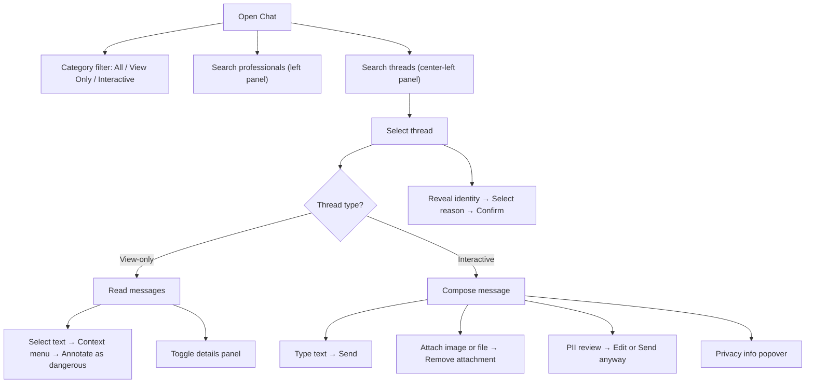

# Chat

## Module explanation

Chat is the communication workspace for clinical conversations. It separates read-only channels from interactive channels, supports identity reveal, message annotation, file/image attachments, and PII review patterns.

## User flow

### Journey 1 — Navigate and select conversations

**Scenario 1a: Filter by channel category**

1. Open **Chat** from the sidebar (or enter via **"View chat"** from another module).
2. In the left panel, click the **"All"**, **"View Only"**, or **"Interactive"** category buttons to filter threads.

**Scenario 1b: Search and select a professional**

1. Type in the **professional search input** in the left panel to filter professionals by name.

**Scenario 1c: Search and select a thread**

1. Type in the **conversation search input** in the center-left panel to search threads by TFP, client ID, or pod.
2. Click a **thread list item** to select and load the conversation.
3. Click **"View more"** or **"Show less"** to expand or collapse the view-only thread list.

### Journey 2 — Read and monitor view-only threads

**Scenario 2a: Browse messages**

1. Select a view-only thread from the conversation list.
2. Read the message history in the center-right panel.
3. Click participant **"+X" / "Show less" buttons** to expand or collapse the participant list.

**Scenario 2b: Annotate a risky message**

1. Select text within a message in a view-only thread → a **context menu** appears.
2. Click **"Annotate as dangerous"** in the context menu to create an annotation.
3. Click the **context menu backdrop** to dismiss without annotating.

**Scenario 2c: Toggle the details panel**

1. Click the **right panel toggle button** (ChevronLeft/ChevronRight) to expand or collapse the chat details panel.

### Journey 3 — Respond in interactive threads

**Scenario 3a: Send a text message**

1. Select an interactive thread from the conversation list.
2. Type in the **message input** (supports Enter key to send).
3. Click the **Send button** to send the message (disabled when input is empty).

**Scenario 3b: Attach files or images**

1. Click the **Add image button** → opens the image file picker (hidden file input).
2. Click the **Add file button** → opens the file picker (hidden file input).
3. After attaching, click the **Remove attachment button** (X icon) to remove it before sending.

**Scenario 3c: PII review before sending**

1. If the message contains potential PII, the **PII Review Modal** opens automatically.
2. Click **"Edit message"** to return to the composer and fix the message.
3. Click **"Send anyway"** to proceed despite the PII warning (only in warning mode).

**Scenario 3d: View privacy guidance**

1. Click the **Privacy info popover trigger** (Info icon) near the composer to see privacy guidance.

### Journey 4 — Reveal participant identity

**Scenario 4a: Request identity reveal**

1. Click the **Reveal identity button** (Lock icon) in the thread header → opens the reveal identity modal.
2. Select a **reason** from the dropdown.
3. Click **"Reveal identity"** to confirm the reveal.
4. Click **"Cancel"** to close without revealing.
5. If the email is visible after reveal, click the **email link** (`mailto:`) to compose an email.

## Diagram

## Dependencies

- Source context from performance views: [Professionals](/docs/professionals)
- Rule-linked operational handling: [Rule Engine](/docs/rule-engine)
