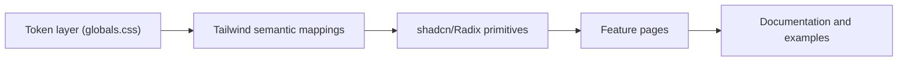

# Design Language

## Module explanation

This page documents Pro360 foundations in a design-system format: color roles, typography usage, iconography, and reusable component patterns.

## Foundations

- **Design style:** modern SaaS, restrained visual noise, clear hierarchy.
- **Surface model:** elevated cards (`shadow-card`) and floating panels (`shadow-panel`) over outline-heavy chrome.
- **Theming:** token-based light/dark with CSS variables in `app/globals.css`.
- **Component architecture:** shadcn-first primitives under `components/ui/*`, composed on feature pages.

## Navigation + Actions

### Action buttons (Save/Cancel/Update/Approve)

- Default: actions go **bottom** of form/page. Not top.
- Right align. Order: `Cancel/Back` (`variant="outline"`) → primary action (default).
- Long form: sticky footer ok.
- Desktop builder 2-col: actions may live **bottom of right details rail** (still bottom).
- Confirm risky actions (approve/regenerate/overwrite) via `Dialog` with reason + confirm.

### Breadcrumbs

- Format: `Module / Entity / Action` (max 3).
- Breadcrumb row = wayfinding only. No primary action buttons there.

## Color

### Semantic color roles

Use semantic tokens for system meaning (success, warning, destructive). Use accents for categorization only.

Live token values below are generated from:

- `design-system/tokens.json` (semantic names)
- `app/globals.css` (light/dark CSS variable values)

### Palette examples

Live rendered color swatches are shown inline below the Color section.

### Accent guidance

- Accent colors should not encode permanent semantic meaning.
- Keep foreground/background in the same hue family for harmony.
- Prefer orange over yellow for warning-like accents when readability is tight.
- On subtle accent backgrounds, add border contrast when needed.

### Token source of truth

- **Semantic tokens:** `design-system/tokens.json`
- **CSS variables:** `app/globals.css` (`:root` and `.dark`)

## Typography

### Application guidelines

- **Primary typeface:** Geist
- **Fallback stack:** Inter, UI sans-serif, system UI, sans-serif
- Keep body text readable and concise (`text-sm` baseline in app UI).
- Use headings for structure and scanability (`h1`, `h2`, `h3` tracking-tight).
- Use 2-4 visible steps of hierarchy between heading levels.
- Avoid all-caps except IDs/acronyms.
- Avoid truncation for critical operational text; reveal full content where possible.

### Typography examples

Live rendered typography samples are shown inline below the Typography section.

### Code excerpt: font setup

```tsx
import { Geist } from "next/font/google";

const geist = Geist({
  subsets: ["latin"],
  variable: "--font-sans",
});
```

## Iconography

### Current implementation status

- **Primary icon set:** Solar via `@iconify/react`.
- **Implementation entrypoints:** `components/ui/solar-icons.tsx` (app icons) and `components/SpiderChart.tsx` (`solar:danger-triangle-bold` warning marker).
- **Add icon policy:** use `solar:add-circle-linear` for current add/create actions for visual clarity and consistency.

### Solar icons currently in use

This is the current, in-code set and can grow over time.

| Purpose area | Solar icons used now |
| --- | --- |
| Navigation and structure | `solar:hamburger-menu-linear`, `solar:alt-arrow-left-linear`, `solar:alt-arrow-right-linear`, `solar:alt-arrow-down-linear`, `solar:alt-arrow-up-linear`, `solar:list-linear`, `solar:widget-2-linear`, `solar:widget-3-linear` |
| Communication and collaboration | `solar:chat-round-linear`, `solar:plain-2-linear`, `solar:paperclip-linear`, `solar:gallery-add-linear`, `solar:users-group-rounded-linear`, `solar:user-linear`, `solar:user-plus-linear`, `solar:user-minus-linear`, `solar:user-cross-linear`, `solar:user-id-linear` |
| Product modules and actions | `solar:book-2-linear`, `solar:case-linear`, `solar:calendar-linear`, `solar:monitor-linear`, `solar:microphone-3-linear`, `solar:presentation-graph-linear`, `solar:document-text-linear`, `solar:archive-minimalistic-linear`, `solar:settings-linear`, `solar:history-linear`, `solar:crown-linear` |
| Data/status and utility | `solar:check-circle-linear`, `solar:close-circle-linear`, `solar:record-circle-linear`, `solar:danger-triangle-linear`, `solar:danger-triangle-bold`, `solar:info-circle-linear`, `solar:question-circle-linear`, `solar:bolt-linear`, `solar:star-linear`, `solar:stars-linear` |
| Commerce and operations | `solar:dollar-linear`, `solar:download-linear`, `solar:upload-linear`, `solar:diskette-linear`, `solar:play-linear`, `solar:refresh-linear`, `solar:refresh-circle-linear`, `solar:cloud-linear`, `solar:map-point-linear`, `solar:megaphone-linear`, `solar:pen-linear`, `solar:menu-dots-linear`, `solar:magnifer-linear`, `solar:clock-circle-linear`, `solar:add-circle-linear` |

### Code excerpt: current Solar usage

```tsx
import { Search, ChevronLeft, MessageSquare } from "@/components/ui/solar-icons";

<Search className="h-4 w-4" />
<ChevronLeft className="h-4 w-4" />
<MessageSquare className="h-4 w-4" />
```

## Components

### UI tech stack

- Next.js App Router + React
- Tailwind CSS + CSS variables
- shadcn-first primitives in `components/ui/*`
- Radix UI under composable wrappers
- `react-markdown` + `remark-gfm` for docs
- `mermaid` for diagrams

### Core component inventory

| Component | Path | Notes |
| --- | --- | --- |
| Button | `components/ui/button.tsx` | Variant + size API via CVA |
| Card | `components/ui/card.tsx` | Base elevated surface with `shadow-card` |
| Table | `components/ui/table.tsx` | Dense operational data display |
| Checkbox | `components/ui/checkbox.tsx` | Radix checkbox with custom indicator |
| DatePicker | `components/ui/date-picker.tsx` | Input + popover calendar composition |
| Dialog | `components/ui/dialog.tsx` | Modal structure and actions |
| Popover | `components/ui/popover.tsx` | Floating contextual content |

### Form and input usage examples

Refer to the code excerpts below for component usage patterns.

### Checkbox example

```tsx
<CheckboxPrimitive.Root
  className={cn(
    "h-4 w-4 rounded-sm border border-input",
    "data-[state=checked]:border-primary data-[state=checked]:bg-primary"
  )}
>
  <CheckboxPrimitive.Indicator className="flex items-center justify-center text-current">
    <Icon name="check" className="h-3.5 w-3.5" />
  </CheckboxPrimitive.Indicator>
</CheckboxPrimitive.Root>
```

## Diagram



## Dependencies

- Product context: `docs/PRO360_PRD.md`
- UI usage examples: [Professionals](professionals.md), [Payout](payout.md), [Growth](growth.md), [Gig](gig.md)
