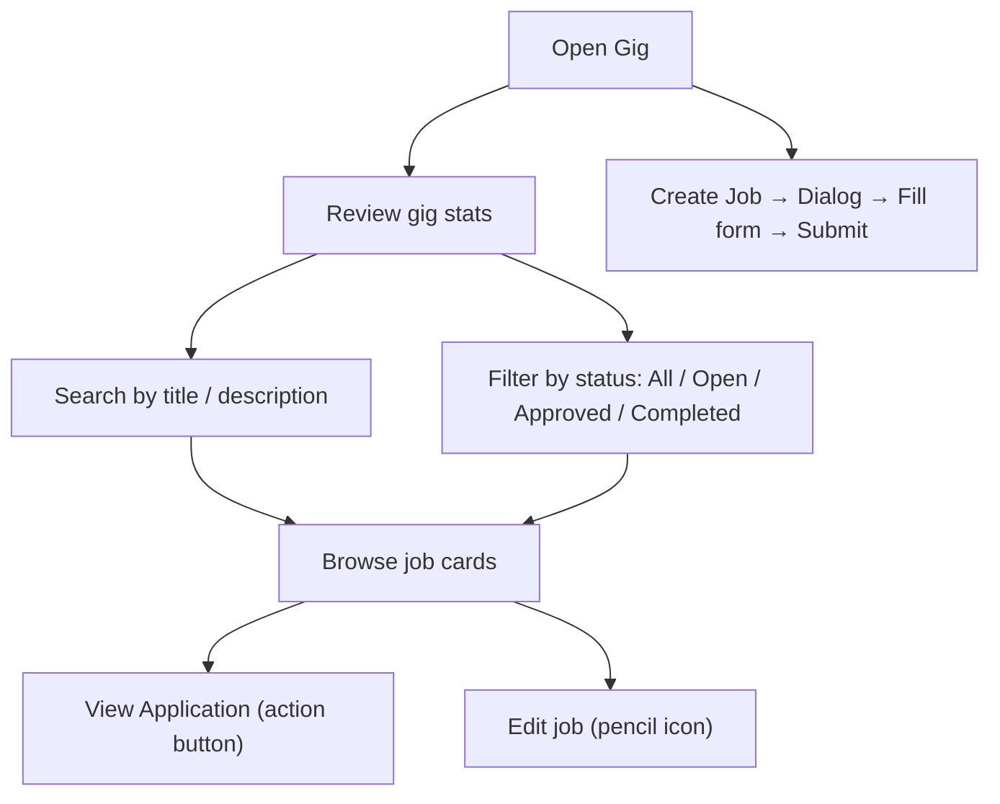

# Gig

## Module explanation

Gig manages external/internal opportunity listings and applicant visibility. Clinical Ops can filter opportunities, inspect applicant interest, create and edit jobs, and work in card mode.

## User flow

### Journey 1 — Browse and filter gig listings

**Scenario 1a: Search and filter jobs**

1. Open **Gig** from the sidebar.
2. Review the high-level gig stats at the top.
3. Type in the **job search input** to filter by title or description.
4. Click the **status filter buttons** (All, Open, Approved, Completed) to filter by job status.

### Journey 2 — Inspect job details

**Scenario 2a: Review a job card**

1. Browse job cards in the listing.
2. Click the **action button** on a card (e.g., "View Application") to see applicant details (disabled if no applicants).

**Scenario 2b: Edit a job**

1. Click the **Edit button** (pencil icon) on a job card to edit the job.

### Journey 3 — Create a new job

**Scenario 3a: Fill and submit the create job form**

1. Click **"Create Job"** in the page header → opens the create job dialog.
2. Fill in the **Title input**, **Description input**, and **Claim categories input**.
3. Click **"Create job"** to submit and close the dialog.
4. Click **"Cancel"** or click outside the dialog to close without creating.

## Diagram

## Dependencies

- Professional assignment context: [Professionals](professionals.md)
