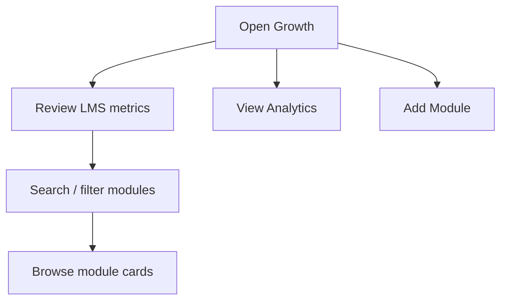

# Growth

## Module explanation

Growth (LMS) tracks training module performance for professionals. Clinical Ops uses this module to monitor enrollment, pass rates, and learning outcomes across all modules.

## User flow

### Journey 1 — Review LMS metrics and modules

**Scenario 1a: Browse the module list**

1. Open **Growth** from the sidebar.
2. Review top-level metrics (modules, enrollments, pass rate, time spent).
3. Scroll through the **module cards** displaying individual learning module details.

**Scenario 1b: Search modules**

1. Type in the **module search input** to filter by module name or category.

### Journey 2 — Access analytics and manage modules

**Scenario 2a: View analytics**

1. Click the **"View Analytics"** button in the page header to open the analytics view.

**Scenario 2b: Add a new module**

1. Click the **"Add Module"** button in the page header to create a new learning module.

## Diagram

## Dependencies

- Professional development context: [Professionals](/docs/professionals)
