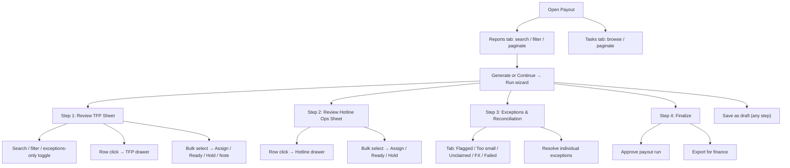

# Payout

## Module explanation

Payout is the operational run center for monthly reconciliation. It includes report and task views, a 4-step run wizard with bulk actions, row-level review drawers, and finalization controls.

## User flow

### Journey 1 — Browse reports and tasks

**Scenario 1a: Review reports**

1. Open **Payout** from the sidebar.
2. The **Reports tab** is active by default.
3. Type in the **search input** to filter runs.
4. Use the **Reviewer filter dropdown** (All reviewers, Sarah Lee, Anton Kraskov) to narrow by assigned reviewer.
5. Use the **Status filter dropdown** (All statuses, Not started, Draft, Blocked, Completed) to filter by run status.
6. Adjust **page size** or use **Previous / Next** pagination to navigate.

**Scenario 1b: Enter a run from reports**

1. For "Not started" runs, click the **Generate button** → navigates to the run wizard.
2. For "Draft" runs, click the **Continue button** → resumes the wizard.
3. For other statuses, click the **Export to PDF button** to export.

**Scenario 1c: Review tasks**

1. Switch to the **Tasks tab**.
2. Use **pagination** (page size selector, Previous/Next) to browse task rows.

### Journey 2 — Execute the payout run wizard

**Scenario 2a: Step 1 — Review TFP Sheet**

1. The wizard opens at Step 1. If the run status is "Not started", click **"Generate"** to generate the TFP sheet.
2. Once generated, use the **search input** to filter rows.
3. Use the **Status filter dropdown** (All statuses, Ready, Flagged, Hold, Too small, Unclaimed) to narrow.
4. Toggle the **"Exceptions only" checkbox** to show only exception rows.
5. Click any **table row** to open the TFP drawer (slide-in panel) for that professional.
6. Use the **header checkbox** (Select All) or individual **row checkboxes** to select rows.

**Scenario 2b: Bulk actions on TFP rows**

1. With rows selected, the **bulk actions bar** appears.
2. Use the **Assign Reviewer dropdown** to assign a reviewer to selected rows.
3. Click **"Mark Ready"** or **"Hold"** to bulk-update status.
4. Type in the **Bulk Note input** and click **"Add Note"** (or press Enter) to add a note to all selected rows.
5. Click **"Clear Selection"** to deselect all.

**Scenario 2c: TFP drawer interactions**

1. The drawer opens when clicking a table row.
2. Type in the **Notes input** to draft a note.
3. Click **"Mark Ready"**, **"Hold"**, **"Request info"**, or **"Assign reviewer"** buttons.
4. Click the **Close button** (X) or click the **backdrop** to dismiss the drawer.

**Scenario 2d: Step 2 — Review Hotline Ops Sheet**

1. Click **Step 2** in the stepper (or advance from Step 1).
2. Use the **header checkbox** (Select All) or individual **row checkboxes** to select rows.
3. Click any **table row** to open the Hotline drawer.
4. With rows selected, use the **bulk actions bar**: Assign Reviewer dropdown, Mark Ready, Hold, or Clear Selection.
5. Use **pagination** to navigate.

**Scenario 2e: Hotline drawer interactions**

1. Type in the **Notes input** to draft a note.
2. Click **"Mark Ready"** or **"Hold"** buttons.
3. Close via the **Close button** or **backdrop click**.

**Scenario 2f: Step 3 — Exceptions & Reconciliation**

1. Click **Step 3** in the stepper.
2. Switch between exception tabs: **"Flagged deltas"**, **"Too small"**, **"Unclaimed"**, **"FX"**, **"Failed payments"**.
3. Click the **"Resolve" button** on individual exception items.

**Scenario 2g: Step 4 — Finalize**

1. Click **Step 4** in the stepper.
2. Click **"Approve payout run"** to approve.
3. Click **"Export for finance"** to generate the finance export.

### Journey 3 — Stepper navigation and draft management

**Scenario 3a: Navigate between steps**

1. Click any **step button** in the stepper to jump to that step (enabled if the step has been reached or the run is a draft).
2. Click **"Save as draft"** (visible during Steps 1-4 when the run is in Draft status) to save progress without finalizing.

## Diagram

## Dependencies

- Rule-driven exception behavior: [Rule Engine](rule-engine.md)
