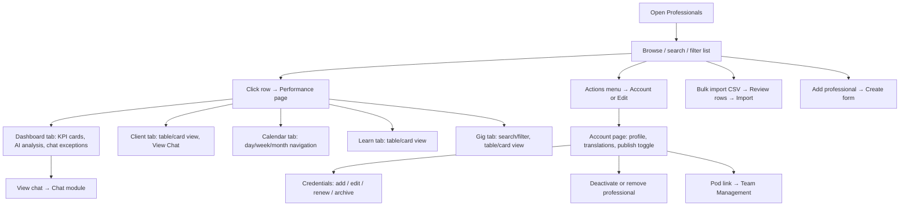

# Professionals

## Module explanation

The Professionals module is the operational directory for Clinical Ops. It provides list management, bulk import, account profile access, credential compliance, and Pro360 performance views for each professional.

## User flow

### Journey 1 — Browse and triage the directory

**Scenario 1a: Search and filter the list**

1. Open **Professionals** from the sidebar.
2. Type in the **search input** to filter by name, email, or ID.
3. Narrow results with the **Profile status dropdown** (Pending introduction, Updated introduction, Imported) and/or the **Credential status dropdown** (Valid, Expiring soon, Expired).
4. Adjust **page size** or use **Previous / Next** pagination to navigate results.

**Scenario 1b: Open a professional from the list**

1. Click a **table row** (or click the **name link**) to navigate to the Performance view.
2. Alternatively, click the **actions menu** (⋯) on a row to choose:
   - **View Performance** → Performance page
   - **View Account** → Account page
   - **Edit Account** → Edit form

**Scenario 1c: Hover for quick context**

1. Hover the **"+N more" roles chip** on a row to see the full role list in a tooltip.
2. Hover the **"Needs attention" credential badge** to see a summary; click **"View credentials"** inside the tooltip to jump to the credentials section.

### Journey 2 — Bulk import professionals

**Scenario 2a: Upload a CSV**

1. Click **"Bulk import CSV"** in the page header to open the import dialog.
2. Click the **"Download CSV template"** link to get the expected format.
3. **Drag-and-drop** a file onto the upload zone, or click the zone (or press Enter/Space) to open the file picker.
4. Click **Cancel** to close the dialog without importing.

**Scenario 2b: Review and fix imported rows**

1. After upload, the import review page opens.
2. Use the **search input** to filter uploaded rows.
3. Use the **row filter dropdown** (All rows, Rows with errors, Rows without errors) to focus.
4. Correct data directly in **editable table cell inputs**; validation errors show beneath each cell.
5. Click **"Import to directory"** when all errors are resolved (disabled while errors exist).
6. Click **Cancel** or **"Back to professionals"** to abort.

### Journey 3 — Create or edit a professional account

**Scenario 3a: Create a new professional**

1. Click **"Add professional"** in the page header → navigates to the create form.
2. Fill in **User Details**: first name, last name, email, dial code dropdown, phone, country dropdown, state/region dropdown, city, bank fields.
3. Upload a photo via the **Upload photo button** (or remove it with **Remove photo**).
4. Fill **Credentials**: profession dropdown, license number input, languages multi-select.
5. Set **Availability & Capacity**: maximum clients input, check-in time checkboxes, break start/end date pickers, break reason textarea.
6. Fill **Public Profile Content**: biography textarea, specialisation/therapy approach/additional experience multi-selects.
7. Toggle **Admin Settings**: Published switch, Demo account switch.
8. Click **"Create professional"** to save, or **"Back"** to cancel.

**Scenario 3b: Edit an existing professional**

1. From the account page, click **"Edit Account"** → navigates to the edit form (same fields as create).
2. Change any fields as needed.
3. In the **Danger Zone**, optionally set a **departure date** via the date picker, or click **"Remove professional"** → opens removal dialog → type the professional ID in the confirmation input → click **"Remove permanently"** (or **Cancel**).
4. Click **"Save changes"** to save, or **"Back"** to cancel.

### Journey 4 — View and manage the account profile

**Scenario 4a: Review account details**

1. Navigate to the account page (via row action menu or from Performance via **"View Account"** button).
2. Review User Details; if the professional has a pod assignment, click the **pod link** to navigate to `/team/{podId}`.
3. In **Public Profile**, click **Translations expand/collapse** to toggle the translations section.
4. Select a language from the **language dropdown**, then use **"Generate draft translation"**, **"Save translation"**, or **"Reset to English"** buttons.
5. Edit translation fields: biography textarea, specialisation/therapy approach/additional experience inputs.

**Scenario 4b: Publish or deactivate**

1. Click the **"Publish / Unpublish" toggle** to change visibility.
2. Click **"Deactivate"** → opens the deactivation dialog → pick a date via the **date picker** → click **"Schedule deactivation"** or **"Immediately deactivate"** (or **Cancel**).
3. Click **"Remove professional"** → opens removal dialog → type the professional ID → click **"Remove permanently"** (or **Cancel**).

**Scenario 4c: Navigate between views**

1. From the account page, click **"View Pro360"** to go to the Performance page.
2. Click **"Edit Account"** to go to the edit form.
3. Click **"Back to list"** to return to the professionals directory.

### Journey 5 — Review professional performance (Pro360)

**Scenario 5a: Dashboard overview**

1. Open the Performance page (from list row click, row action menu, or account page).
2. Click **"View Account"** in the header to switch to the account view.
3. Use the **tab bar** to switch between: Dashboard, Client, Calendar, Learn, Gig.

**Scenario 5b: Dashboard tab deep-dive**

1. Click **"Generate improvement summary"** to trigger the AI analysis.
2. After generation, click **"View full analysis"** to open the AI improvement modal (close via dialog).
3. Click the **SLA compliance info button** (i) to open the SLA info modal.
4. Click the **"View log" link** on the case notes card to scroll to case notes.
5. Click the **Rating card** to open the rating modal.
6. Click the **Feedback card** to open the feedback modal.
7. Switch **chat exception tabs** (≥ 1 / ≥ 3 / ≥ 5 working days) to filter exceptions.
8. Click a **"View chat"** button on an exception row to navigate to the chat thread.
9. Use **case notes pagination** (page size selector, Previous/Next) to browse notes.

**Scenario 5c: Client tab**

1. Toggle between **Table view** and **Card view** using the view mode buttons (List / LayoutGrid icons).
2. In either view, click a **"View Chat"** button to open the chat filtered by that professional and client.

**Scenario 5d: Calendar tab**

1. Switch view mode: **Day**, **Week**, or **Month** buttons.
2. In day view, use **Previous day**, **Today**, and **Next day** buttons.
3. In month view, use **Previous month / Next month** buttons and click individual **date buttons** in the calendar grid.

**Scenario 5e: Learn tab**

1. Toggle between **Table view** and **Card view**.
2. Browse course cards or table rows (read-only).

**Scenario 5f: Gig tab**

1. Toggle between **Table view** and **Card view**.
2. Use the **search input** to filter by gig name.
3. Use the **status filter dropdown** (All Status, Applied, Completed, Expired) and the **type filter dropdown** (All Types, Webinar, Roadshow, Workshop) to narrow results.

### Journey 6 — Manage credentials and compliance

**Scenario 6a: Browse and filter credentials**

1. From the account page, scroll to the Credentials section.
2. Use the **status filter dropdown** (All statuses, Valid, Expiring soon, Expired) and the **type filter dropdown** (All types, Contract, License, Training Certificate, Other) to filter.
3. Use **Previous / Next** pagination to navigate.

**Scenario 6b: Add a credential**

1. Click **"Add document"** (in the header or empty state).
2. In the dialog, select a **type** from the dropdown, fill in **credential name**, **issuing body**, **start date** (date picker), **expiry date** (date picker), **notes** (textarea).
3. Click **"Upload file"** to attach a document.
4. Click **"Add document"** to save (disabled if type or name is missing), or **Cancel** to close.

**Scenario 6c: Edit, renew, or archive a credential**

1. Click a **credential card** to open the view dialog (read-only details and history).
2. Click the **Edit button** (pencil icon) on a card to open the edit dialog → make changes → click **"Save changes"**.
3. For Contract-type credentials, click the **Renew button** (refresh icon) → fill the renewal form → click **"Renew contract"**.
4. Click the **Archive button** (archive icon) to archive the credential.

## Diagram

## Dependencies

- Team assignment context: [Team Management](/docs/team-management)
- Thread-level interactions: [Chat](/docs/chat)
- Opportunity context: [Gig](/docs/gig)
- Schedule context: [Appointments](/docs/appointments)
