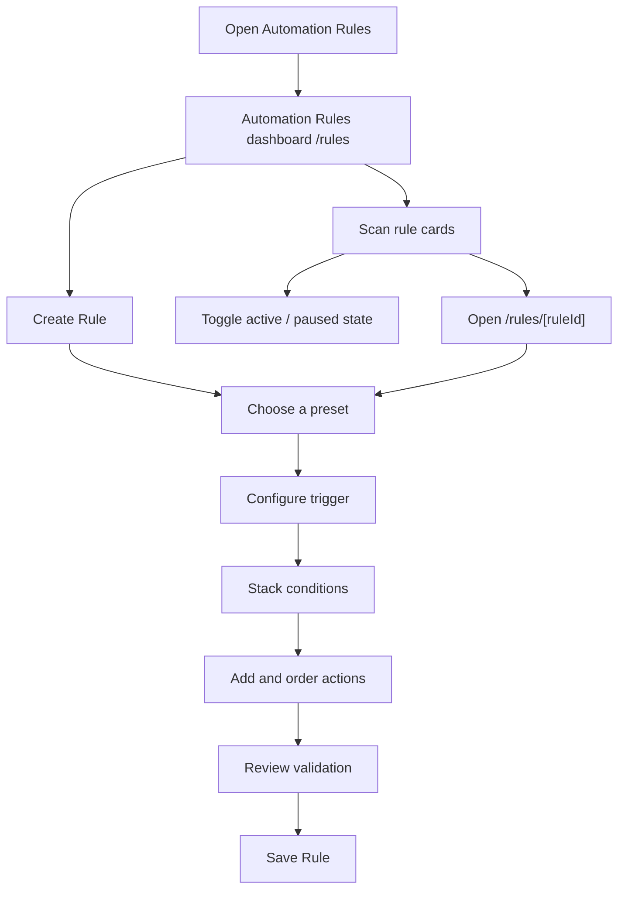

# Automation Rules

## Module explanation

Automation Rules helps Clinical Ops design and manage modular automation flows without writing code. Each rule follows a clear IFTTT mental model: define the trigger, stack the required conditions, and configure the resulting actions.

## User flow

### Journey 1 — Launch a new rule from the dashboard

**Scenario 1a: Enter the create canvas**

1. Open **Automation Rules** from the sidebar.
2. Land on the **Automation Rules dashboard** and review the hero entry point.
3. Click **"Create Rule"** to open `/rules/new`.

### Journey 2 — Review and manage rules from the dashboard

**Scenario 2a: Scan existing rules**

1. Review cards in the **Your Rules** grid.
2. Use **All Rules** or **By Team** to focus the list.
3. Read the Trigger → Actions preview on each card to understand the automation quickly.

**Scenario 2b: Enable or pause a rule**

1. Use the card toggle to enable or pause the rule.
2. The card updates optimistically and keeps the status badge in sync.

**Scenario 2c: Open an existing rule in edit mode**

1. Click any rule card.
2. Open `/rules/[ruleId]` in the dedicated rule builder.

### Journey 3 — Build or edit rule logic in the builder

**Scenario 3a: Start from a preset**

1. Optionally turn on presets to reveal the Clinical Ops quick-start options.
2. Choose a preset to prefill the rule with a common trigger, condition, and action.
3. Review the preselected trigger, condition, and action.

**Scenario 3b: Configure the trigger**

1. Enter or edit the rule name.
2. Select a **Trigger type**.
3. Select a **Trigger**.
4. Let the internal source mapping resolve automatically.
5. If needed, review the internal source metadata in the draft state or API payload.

**Scenario 3c: Stack conditions**

1. Add one or more condition rows.
2. For each row, configure **Parameter**, **Operator**, and **Value**.
3. Remove unnecessary rows with the delete action.

**Scenario 3d: Define actions**

1. Choose one or more actions in the **Actions** section.
2. Reorder the actions locally when needed.
3. Review action descriptions before saving.

**Scenario 3e: Review validation and save**

1. Check inline validation and the logic health banner.
2. Review sticky metadata on the right rail.
3. Click **"Save Rule"** when the rule is valid, or **"Discard Changes"** to reset the draft.

## Diagram

## Dependencies

- Shared UI primitives: `Card`, `Badge`, `Switch`, `Select`, `Input`, `Button`
- App routing under `app/(shell)/rules`
- Mock rules adapter for summaries and rule definitions: `features/rules/api`
