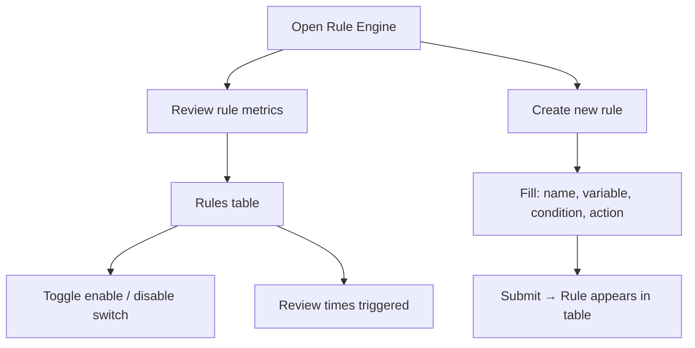

# Rule Engine

## Module explanation

Rule Engine stores and controls operational rules. Clinical Ops can create trigger/condition/action rules, monitor trigger counts, and enable or disable rules based on current policy.

## User flow

### Journey 1 — Create a new rule

**Scenario 1a: Fill and submit the rule form**

1. Open **Rule Engine** from the sidebar.
2. In the create form, enter a **Rule name** in the text input.
3. Select a **Variable** from the dropdown (predefined variable list).
4. Enter a **Condition** in the text input.
5. Select an **Action** from the dropdown (predefined action list).
6. Click **"Create Rule"** to submit — the new rule appears in the table.

### Journey 2 — Monitor and manage existing rules

**Scenario 2a: Review rule metrics**

1. Review the summary metrics displayed above the rules table.

**Scenario 2b: Enable or disable a rule**

1. In the rules table, toggle the **Enable/Disable switch** on any rule row to change its active state.

**Scenario 2c: Monitor trigger activity**

1. Review the "Times triggered" column in the rules table for each rule.

## Diagram

## Dependencies

- Payout reconciliation behavior: [Payout](/docs/payout)
- Chat moderation/action hooks: [Chat](/docs/chat)
