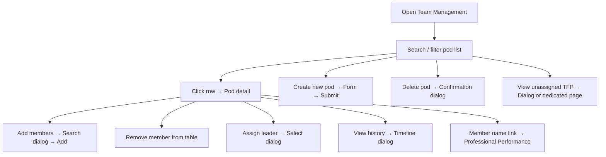

# Team Management

## Module explanation

Team Management is the source of truth for pod operations. Clinical Ops can create pods, assign leaders, manage members, monitor unassigned professionals, and review pod history.

## User flow

### Journey 1 — Browse and manage the pod directory

**Scenario 1a: Search and filter pods**

1. Open **Team Management** from the sidebar.
2. Type in the **search input** to filter by pod name or leader name.
3. Use the **Pod leader filter dropdown** (All leaders, or a specific leader) to narrow results.
4. Use the **Status filter dropdown** (All statuses, Active, Inactive) to filter by pod status.
5. Adjust **page size** or use **Previous / Next** pagination to navigate results.

**Scenario 1b: Open a pod from the list**

1. Click a **table row** (or press Enter/Space) to navigate to the pod detail page.
2. Alternatively, click the **Edit button** (pencil icon) on a row to go directly to the pod detail.

**Scenario 1c: Delete a pod from the list**

1. Click the **Delete button** (trash icon) on a row → opens the delete confirmation dialog.
2. Click **"Delete"** to confirm, or **"Cancel"** to close.

### Journey 2 — Create a new pod

**Scenario 2a: Fill and submit the create form**

1. Click **"Create new pod"** in the page header → navigates to the create pod page.
2. Fill in the **Pod name input** (required).
3. Select a leader from the **Pod leader dropdown** (None, or an unassigned active TFP).
4. Select a status from the **Status dropdown** (Active, Inactive).
5. Optionally fill the **Notes input**.
6. Click **"Create pod"** to submit and navigate to the new pod detail, or click **"Cancel"** to return to the pod list.

### Journey 3 — Manage pod membership and leadership

**Scenario 3a: Add members to a pod**

1. Open a pod detail page (from list row click or edit button).
2. Click **"Add Members"** in the card header → opens the add members dialog.
3. Use the **search input** in the dialog to filter TFPs by name or email.
4. Click the **"Add" button** next to a TFP to add them to the pod (dialog closes, notification shown).
5. Click **"Close"** to dismiss without adding.

**Scenario 3b: Remove a member**

1. In the pod detail members table, click the **Remove button** (trash icon) on a member row.
2. The member is removed and a notification is shown.

**Scenario 3c: Assign a pod leader**

1. Click **"Assign leader"** in the card header → opens the assign leader dialog.
2. Select a member from the **Leader dropdown** (lists current pod members, or shows "Add members first" if empty).
3. The leader is assigned and a notification is shown.
4. Click **"Cancel"** to close without assigning.

**Scenario 3d: Navigate to a member's professional profile**

1. Click a **member name link** in the members table → navigates to `/professionals/{id}/performance`.

### Journey 4 — Review pod history

**Scenario 4a: View the timeline**

1. Click **"View history"** in the pod detail card header → opens the history dialog.
2. Review timeline entries (read-only).
3. Click **"Close"** to dismiss.

### Journey 5 — Monitor unassigned professionals

**Scenario 5a: View unassigned TFPs from the dialog**

1. Click **"View unassigned TFP"** in the page header → opens the unassigned TFP dialog (shows count badge).
2. Use the **search input** in the dialog to filter by name or email.
3. Review the TFP cards (read-only display).

**Scenario 5b: View unassigned TFPs on the dedicated page**

1. Navigate to `/team/unassigned`.
2. Click **"Back to pod list"** to return to the main list.
3. Click a **member name link** in the table → navigates to the professional's performance page.
4. Use **Previous / Next** pagination to browse.

### Journey 6 — Navigate the pod detail page

**Scenario 6a: Header navigation**

1. Click **"Back to pod list"** to return to the main team management list.
2. Use **members table pagination** (page size selector, Previous/Next) to browse large member lists.

## Diagram

## Dependencies

- Professional records and context links: [Professionals](professionals.md)
